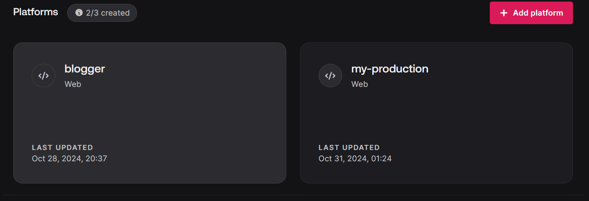

# Steps to Run this project. 

## 1. Clone Repository with 
```
git clone https://github.com/Hardik7843/Blogging-site/tree/master
```

## 2. Create an .env file in root directory populate it with following content.

```
VITE_APPWRITE_URL="https://cloud.appwrite.io/v1"
VITE_APPWRITE_PROJECT_ID="****"
VITE_APPWRITE_DATABASE_ID="1"
VITE_APPWRITE_COLLECTION_ID="****"
VITE_APPWRITE_BUCKET_ID="****"
```

## 3. Setting up Application on Backend Platform
Now got to https://cloud.appwrite.io/console and create a new project with appropriate name. and copy it's ID and paste it into `.env` file.

Similarly, Create a database and storage bucket in the newly created project. And copy paste the values of databaseID and BucketID into `.env` file.

Now, create a collection named `articles` into database.
Also create following attributes shown in picture into that collection.


Lastly, create storage bucket in storage sections to store images.

## 4. Now rest of the code should work just fine after step 3. 
Before Running the Code Plase create an platform or running server via appwrite console for testing it. 

